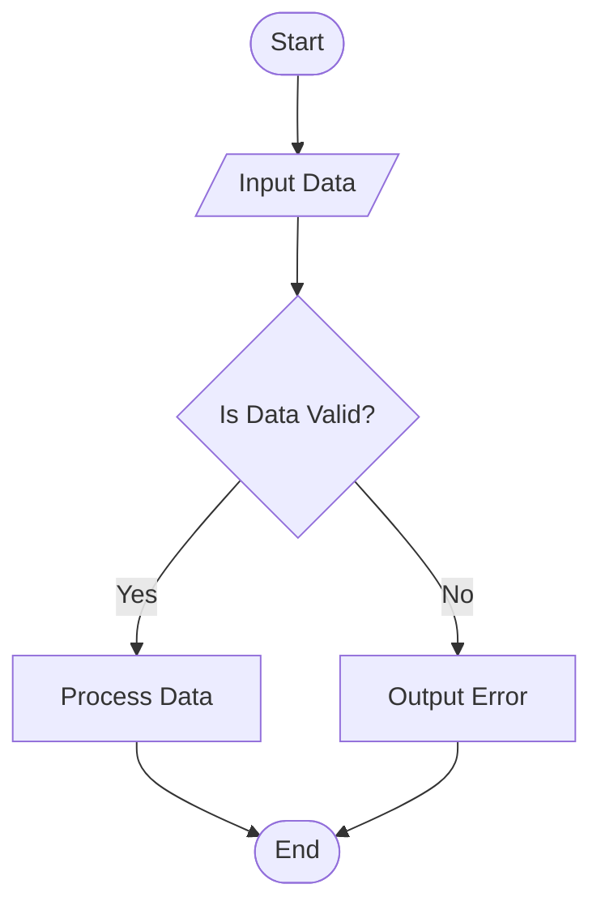
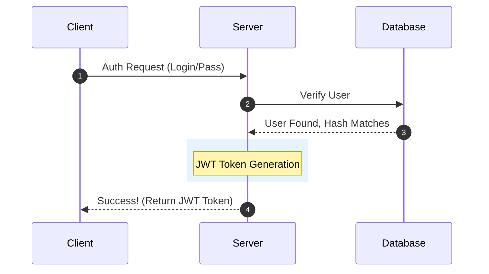
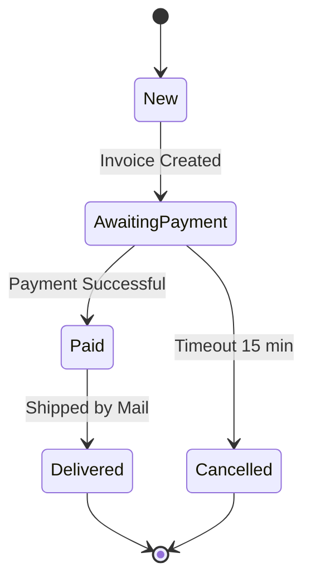

[🇺🇦 Читати цю статтю в оригіналі українською](/posts/how-to-draw-with-mermaid/)

---

Any technical blog, documentation, or project description becomes instantly clearer when accompanied by a visual diagram. Typically, developers draw diagrams in graphic editors (like draw.io or Figma), export them to PNG, and add them as images.

However, this is inconvenient: with the slightest change to the diagram, you have to recreate and re-export the entire file.

There is a better way — **Mermaid.js**. This is a tool that allows you to draw diagrams and flowcharts directly in Markdown files using simple text-based code. The browser itself will convert this code into a vector SVG image!

Today, we will dissect how to enable Mermaid in your blog and learn how to draw the main types of diagrams with real-world examples.

---

## How to Enable Mermaid in Jekyll (Chirpy Theme)

In the Chirpy theme, Mermaid support is already built-in out of the box. To enable diagram rendering on a specific page or article, you only need to add one line to the frontmatter at the very beginning of the file:

```yaml
---
title: "Title of Your Article"
# ... other configurations ...
mermaid: true
---
```

Now, any code block labeled ````mermaid` will automatically render as a diagram.

---

## Example 1. Flowcharts

Flowcharts are the simplest and most popular type of diagrams. They illustrate algorithms, network infrastructure, or processes.

A flowchart code starts with a direction: `flowchart TD` (Top-Down) or `flowchart LR` (Left-to-Right).

### Code:
```text

```

### Result on the website:


> 💡 **Notice the node shapes:** `([rounded corners])` designate start/finish, `[/parallelograms/]` represent input/output, `[rectangles]` designate an action, and `{diamonds}` represent a condition (branching).

---

## Example 2. Sequence Diagrams

This type of diagram is ideal for describing interactions between a client, server, database, or external APIs during authentication or data exchange.

### Code:
```text

```

### Result on the website:


---

## Example 3. State Diagrams

Excellent for visualizing the lifecycle of processes or object states (for example, an order in an online shop: New -> Awaiting Payment -> Paid -> Delivered).

### Code:
```text

```

### Result on the website:


---

## 3 Critical Lifehacks When Working with Mermaid

When you start drawing more complex diagrams, you might run into rendering errors or cut-off text. Keep these rules in mind:

1. **Line Breaks (`<br>`)**  
   If there is too much text in a block, the node becomes very wide, and its end may get cut off by the browser. Use the HTML tag `<br>` to split text into multiple lines:
   `node["Node Name<br>Additional Description or IP"]`

2. **Required Quotes for Special Characters**  
   If text in a block contains colons (`:`), parentheses, or spaces in subgraph titles, always wrap it in double quotes. Otherwise, Mermaid will throw a *Syntax error in text* error:
   * Correct: `node["Server: 192.168.1.1"]`
   * Incorrect: `node[Server: 192.168.1.1]`

3. **Block Styling**  
   You can color your diagrams by adding style rules to the end of the Mermaid code (specifying background color, border color, and line thickness):
   `style node_id fill:#ff9900,stroke:#333,stroke-width:2px`

---

## Conclusion

Mermaid makes maintaining documentation or project descriptions significantly more convenient. Because diagrams are described in text, they can be stored directly in Git alongside the code, allowing you to see change history (diffs) and update them in seconds with a simple text edit.
