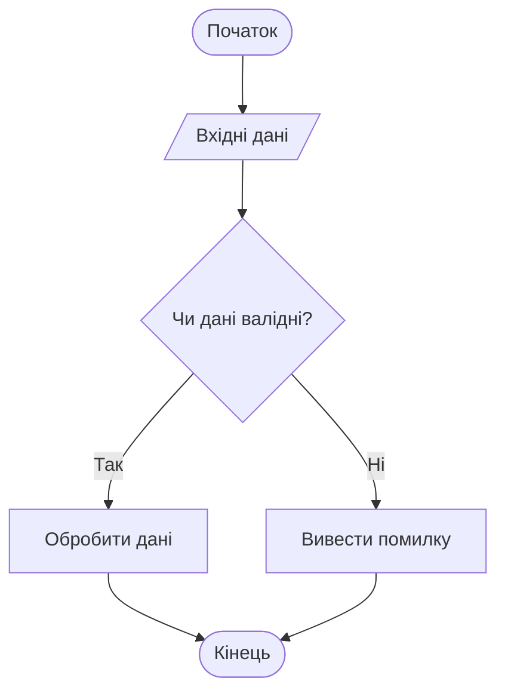
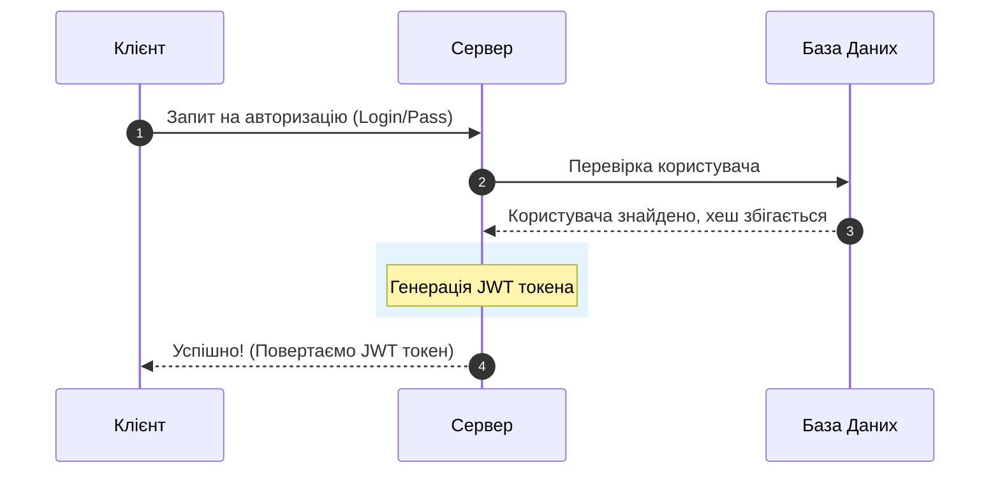
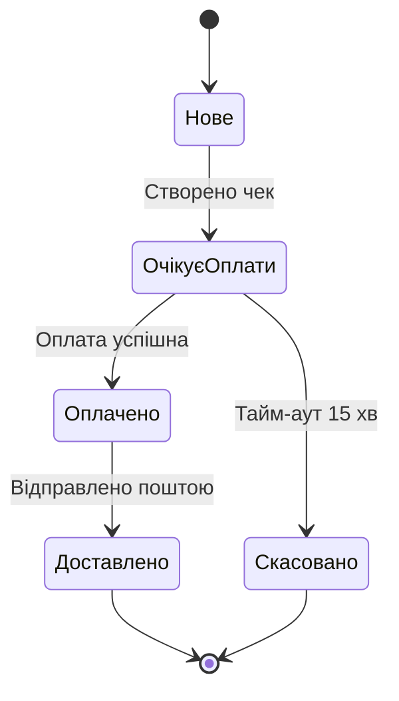

[🇬🇧 Read this article in English](/posts/how-to-draw-with-mermaid-en/)

---

Будь-який технічний блог, документація чи опис проекту стають у рази зрозумілішими, якщо додати до них візуальну схему. Зазвичай розробники малюють графіки в графічних редакторах (як-от draw.io чи Figma), експортують їх у PNG та додають картинкою.

Але це незручно: при найменшій зміні схеми доводиться переробляти та переекспортувати весь файл.

Вихід є — **Mermaid.js**. Це інструмент, який дозволяє малювати діаграми та блок-схеми безпосередньо у Markdown-файлах за допомогою простого текстового коду. Браузер сам перетворить цей код на векторне SVG-зображення!

Сьогодні ми розберемо, як підключити Mermaid у вашому блозі та навчимося малювати основні типи схем із реальними прикладами.

---

## Як увімкнути Mermaid у Jekyll (тема Chirpy)

У темі Chirpy підтримка Mermaid вже вбудована з коробки. Щоб увімкнути рендеринг схем на конкретній сторінці чи у статті, вам достатньо додати лише один рядок у метадані (frontmatter) на самому початку файлу:

```yaml
---
title: "Назва вашої статті"
# ... інші налаштування ...
mermaid: true
---
```

Тепер будь-який блок коду з позначкою ````mermaid` буде автоматично малюватися як схема.

---

## Приклад 1. Блок-схеми (Flowcharts)

Блок-схеми — це найпростіший та найпопулярніший тип діаграм. Вони ілюструють алгоритми, мережеву інфраструктуру або процеси.

Код блок-схеми починається з напрямку: `flowchart TD` (зверху-вниз / Top-Down) або `flowchart LR` (зліва-направо / Left-to-Right).

### Код:
````text

````

### Результат на сайті:


> 💡 **Зверніть увагу на форми вузлів:** `([круглі кути])` позначають старт/фініш, `[/паралелограм/]` — вхід/вихід, `[прямокутник]` — дію, а `{ромб}` — умову (розгалуження).

---

## Приклад 2. Діаграми послідовності (Sequence Diagrams)

Цей тип схем ідеально підходить для опису взаємодії між клієнтом, сервером, базою даних чи зовнішніми API при авторизації або обміні даними.

### Код:
````text

````

### Результат на сайті:


---

## Приклад 3. Діаграми станів (State Diagrams)

Чудово підходять для візуалізації життєвого циклу процесів або станів об'єктів (наприклад, замовлення в інтернет-магазині: Нове -> Оплачене -> Доставлене).

### Код:
````text

````

### Результат на сайті:


---

## 3 важливі лайфхаки при роботі з Mermaid

Коли ви почнете малювати складніші схеми, ви можете зіткнутися з помилками рендерингу або обрізанням тексту. Тримайте ці правила в голові:

1. **Перенесення тексту (`<br>`)**  
   Якщо в блоці забагато тексту, вузол стане дуже широким, а його кінець може обрізатися браузером. Використовуйте HTML-тег `<br>` для розбиття тексту на декілька рядків:
   `вузол["Назва вузла<br>Додатковий опис або IP"]`

2. **Обов'язкові лапки для спецсимволів**  
   Якщо текст у блоці містить двокрапки (`:`), дужки або пробіли в назвах підгруп, завжди беріть його у подвійні лапки. Інакше Mermaid видасть помилку *Syntax error in text*:
   * Правильно: `вузол["Сервер: 192.168.1.1"]`
   * Неправильно: `вузол[Сервер: 192.168.1.1]`

3. **Стилізація блоків**  
   Ви можете розфарбувати свої схеми, додавши стиль в кінець коду Mermaid (вказується колір фону, обводка та товщина лінії):
   `style вузол_id fill:#ff9900,stroke:#333,stroke-width:2px`

---

## Висновок

Mermaid робить ведення документації чи описів проектів суттєво зручнішим. Оскільки діаграми описуються текстом, їх можна зберігати прямо в Git разом із кодом, бачити історію змін (diff) та оновлювати за лічені секунди простим редагуванням тексту.
