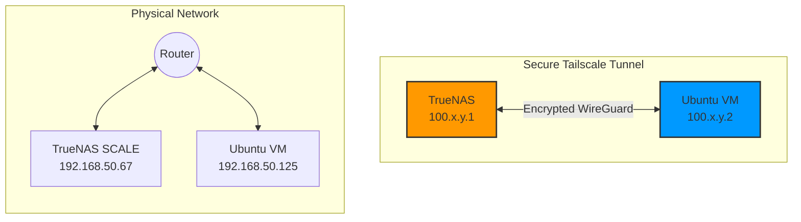

[🇺🇦 Читати цю статтю в оригіналі українською](/posts/tailscale-in-homelab/)

---

In the world of home laboratories (Homelab), a very popular scenario is having a powerful storage server (like **TrueNAS SCALE**) hosting virtual machines (like **Ubuntu Server**) to run Docker containers, Prometheus monitoring, or media servers.

However, almost everyone who attempts this faces an annoying issue: **the virtual machine and the TrueNAS host cannot see each other on the local network**. You can ping the router, other home devices, and the internet, but trying to connect between the VM and the TrueNAS host throws a `no route to host` or timeout error.

Today, we will dissect why this happens and how to resolve this problem in 3 minutes completely safely.

---

## Why Can't the Virtual Machine See Its Host?

The reason lies in the Linux virtualization architecture (KVM/QEMU) used by TrueNAS SCALE.

When you connect a virtual machine to the host's physical network interface (e.g., `enp3s0`), the operating system kernel, for security and network loop prevention reasons, **isolates the virtual interface of the machine from the physical interface of the host**.

Packets from the VM go out to the physical switch/router, but they cannot return to the host through the same physical interface — the TrueNAS OS simply drops them.

---

## The Old (Dangerous) Way: Network Bridge (br0)

The traditional solution to this problem is creating a network bridge (`br0`) in TrueNAS settings:
1. Create a Bridge type interface.
2. Add the physical network card as a member of the bridge.
3. Move the IP address and DHCP settings from the physical card to the bridge.
4. Switch the VM to work through this bridge.

⚠️ **What is the risk?**  
Configuring network interfaces on a storage host "live" via the web UI is playing with fire. A single mistake in selecting the card or DHCP settings will completely cut off your access to TrueNAS. You will have to find a monitor, keyboard, and physically connect to the server console to reset the network settings.

---

## The New (Safe and Simple) Way: Tailscale

Instead of messing with network cards and risking your connection, we can create a secure virtual overlay network on top of our local network using **Tailscale** (a free mesh-VPN based on the WireGuard protocol).

Tailscale will combine TrueNAS and the virtual machine into a secure, direct tunnel network, completely ignoring virtualization restrictions.



### Step 1. Installing Tailscale on TrueNAS SCALE

TrueNAS SCALE has an official Tailscale application in its catalog:
1. Go to **Apps** -> **Discover Apps**.
2. Search for **Tailscale** and click **Install**.
3. Leave all settings as default and click **Save**.
4. After launching, open the app's Web Portal (or check logs), follow the authorization link, and bind the device to your Tailscale account.

### Step 2. Installing Tailscale on Ubuntu VM

Log into your virtual machine via SSH and run the official installation script:

```bash
curl -fsSL https://tailscale.com/install.sh | sh
```

Once the installation is complete, initialize the connection:

```bash
sudo tailscale up
```

The script will output an authorization URL. Copy it into your browser, log in with the same account, and the VM will appear in your Tailscale admin panel.

### Step 3. Verification and Usage

Now both of your servers have internal IP addresses of the `100.x.y.z` range. You can verify the connection by running a simple ping from the VM to the new TrueNAS Tailscale IP:

```bash
ping -c 3 100.111.222.33 # Specify your TrueNAS IP from the Tailscale admin panel
```

Pings will start flowing instantly! The network virtualization barrier has been bypassed without touching any physical network interfaces.

Now you can:
* Configure Prometheus metrics collection on the VM from Node Exporter on TrueNAS by specifying the new Tailscale IP in `prometheus.yml`.
* Securely mount local TrueNAS shares (NFS, SMB) inside the VM.
* Access the TrueNAS web panel from any of your devices (even a mobile phone over 4G) simply by running the Tailscale client on it.

---

## Conclusion

Tailscale once again proves to be a "Swiss Army knife" for system administrators and Homelab enthusiasts. It allows you to solve complex architectural limitations of virtualization networks elegantly, quickly, and — most importantly — with zero risk of breaking access to your main server.
