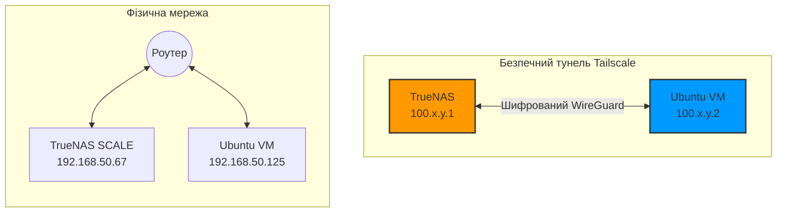

У світі домашніх лабораторій (Homelab) дуже популярний сценарій: у вас є потужний сервер збереження даних (наприклад, **TrueNAS SCALE**), всередині якого ви запускаєте віртуальні машини (наприклад, **Ubuntu Server**) для крутіння Docker-контейнерів, моніторингу Prometheus чи медіасерверів.

Але майже кожен, хто намагається це зробити, стикається з незрозумілою проблемою: **віртуальна машина та сам сервер TrueNAS не бачать один одного по мережі**. Ви можете пінгнути роутер, інші ПК вдома, інтернет, але спроба з'єднатися між VM та хостом TrueNAS видає помилку `no route to host` або таймаут.

Сьогодні ми розберемо, чому це відбувається та як вирішити цю проблему за 3 хвилини абсолютно безпечно.

---

## Чому віртуальна машина не бачить свій хост?

Причина лежить в архітектурі віртуалізації Linux (KVM/QEMU), яку використовує TrueNAS SCALE. 

Коли ви підключаєте віртуальну машину до стандартного фізичного мережевого інтерфейсу сервера (наприклад, `enp3s0`), ядро операційної системи з міркувань безпеки та запобігання мережевим петлям **ізолює віртуальний інтерфейс машини від реального інтерфейсу хоста**. 

Пакети з VM виходять назовні в комутатор/роутер, але повернутися назад на хост через ту саму фізичну карту вони не можуть — операційна система TrueNAS їх просто скидає.

---

## Старий (небезпечний) шлях: Мережевий міст (Bridge)

Традиційне вирішення цієї проблеми — створення мережевого моста (`br0`) в налаштуваннях TrueNAS:
1. Ви створюєте інтерфейс типу Bridge.
2. Додаєте фізичну карту як учасника моста.
3. Переносите IP-адресу та налаштування DHCP з фізичної карти на міст.
4. Перемикаєте віртуальну машину на роботу через цей міст.

⚠️ **У чому ризик?**  
Налаштування інтерфейсів на хості зберігання даних «наживу» через веб-інтерфейс — це гра з вогнем. Одна помилка у виборі карти чи налаштуванні DHCP, і ви повністю втрачаєте зв'язок із TrueNAS. Доведеться шукати монітор, клавіатуру та лізти в консоль сервера, щоб скинути налаштування мережі.

---

## Новий (безпечний і простий) шлях: Tailscale

Замість того, щоб копатися в мережевих картах та ризикувати зв'язком, ми можемо створити віртуальну overlay-мережу поверх нашої локальної за допомогою **Tailscale** (це безкоштовний меш-VPN на базі протоколу WireGuard).

Tailscale об'єднає TrueNAS та віртуальну машину в безпечну пряму тунельну мережу, повністю ігноруючи обмеження віртуалізації.



### Крок 1. Встановлення Tailscale на TrueNAS SCALE

TrueNAS SCALE має офіційний додаток Tailscale у своєму каталозі:
1. Перейди в меню **Apps** -> **Discover Apps**.
2. Знайди у пошуку **Tailscale** та натисни **Install**.
3. Залиш усі налаштування за замовчуванням та натисни **Save**.
4. Після запуску додатку відкрий його веб-портал (або переглянь логи), перейди за посиланням для авторизації та прив'яжи пристрій до свого профілю Tailscale.

### Крок 2. Встановлення Tailscale на Ubuntu VM

Зайди по SSH на свою віртуальну машину та запусти офіційний скрипт встановлення:

```bash
curl -fsSL https://tailscale.com/install.sh | sh
```

Після завершення встановлення ініціалізуй підключення:

```bash
sudo tailscale up
```

Скрипт виведе утиліту з посиланням на авторизацію. Скопіюй його в браузер, увійди під тим самим акаунтом — і віртуальна машина з'явиться в твоїй мережі Tailscale.

### Крок 3. Перевірка та використання

Тепер обидва твої сервери отримали внутрішні IP-адреси типу `100.x.y.z`. Перевірити зв'язок можна простим пінгом з віртуальної машини на нову IP-адресу TrueNAS:

```bash
ping -c 3 100.111.222.33 # Вкажи IP-адресу TrueNAS з панелі Tailscale
```

Пінги підуть миттєво! Мережевий бар'єр віртуалізації подолано без жодного торкання фізичних налаштувань мережі.

Тепер ти можеш:
* Налаштувати збір метрик Prometheus на VM з Node Exporter на TrueNAS, вказавши в конфігу `prometheus.yml` нову адресу Tailscale.
* Безпечно підключатися до локальних шарів TrueNAS (NFS, SMB) з віртуальної машини.
* Мати доступ до веб-панелі TrueNAS з будь-якого свого пристрою (навіть телефону через 4G), просто увімкнувши клієнт Tailscale на ньому.

---

## Підсумок

Tailscale вкотре доводить, що є «швейцарським ножем» для системного адміністратора та ентузіаста Homelab. Він дозволяє вирішувати складні архітектурні обмеження мереж віртуалізації елегантно, швидко та — найголовніше — з нульовим ризиком зламати доступ до основного сервера.
